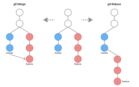

# Введение
## Системы контроля версий

* **Система контроля версий (VCS)** - это система, записывающая изменения в файл или набор файлов в течение времени и позволяющая вернуться позже к определённой версии.Локальное хранение версий - способ подвержен ошибкам.Пример - RCS.
* Централизованная VCS (CVCS) - для совместной работы.
    * Shared repository on server + clients.Примеры - CVS, Subverion, Perforce.
    * CVCS - SPOF!
* Рапределённая VCS (DVCS) - клиенты не просто скачивают снимок всех файлов (состояние файлов на определённый момент времени) — они полностью копируют репозиторий.

>В этом случае, если один из серверов, через который разработчики обменивались данными, умрёт, любой клиентский репозиторий может быть скопирован на другой сервер для продолжения работы. Каждая копия репозитория является полным бэкапом всех данных. Более того, многие DVCS могут одновременно взаимодействовать с несколькими удалёнными репозиториями, благодаря этому вы можете работать с различными группами людей, применяя различные подходы единовременно в рамках одного проекта. Это позволяет применять сразу несколько подходов в разработке, например, иерархические модели, что совершенно невозможно в централизованных системах.

## git

Git хранит именно *снимки каждой версии*, а не список различий между версиями (дельту). Если версия не менялась, то при коммите git делает ссылку на предыдущую версию. Это делает Git больше похожим на миниатюрную файловую систему с удивительно мощными утилитами, надстроенными над ней, нежели просто на VCS.

>Для работы большинства операций в Git достаточно локальных файлов и ресурсов в основном, системе не нужна никакая информация с других компьютеров в вашей сети. Для примера, чтобы посмотреть историю проекта, Git не нужно соединяться с сервером для её получения и отображения — система просто считывает данные напрямую из локальной базы данных. Это означает, что вы увидите историю проекта практически моментально. Если вам необходимо посмотреть изменения, сделанные между текущей версией файла и версией, созданной месяц назад, Git может найти файл месячной давности и локально вычислить изменения, вместо того, чтобы запрашивать удалённый сервер выполнить эту операцию, либо вместо получения старой версии файла с сервера и выполнения операции локально.В Git для всего вычисляется хеш-сумма, и только потом происходит сохранение. В дальнейшем обращение к сохранённым объектам происходит по этой хеш-сумме. Это значит, что невозможно изменить содержимое файла или каталога так, чтобы Git не узнал об этом. Данная функциональность встроена в Git на низком уровне и является неотъемлемой частью его философии. Вы не потеряете информацию во время её передачи и не получите повреждённый файл без ведома Git. Механизм, которым пользуется Git при вычислении хеш-сумм, называется SHA-1 хеш.Git сохраняет все объекты в свою базу данных не по имени, а по хеш-сумме содержимого объекта.Когда вы производите какие-либо действия в Git, практически все из них только добавляют новые данные в базу Git.

У Git есть **три основных состояния**, в которых могут находиться ваши файлы:
* изменён (**modified**); файлы изменены, но не зафиксированы.
* индексирован (**staged**) - файлы изменены, не зафиксированы, отмечены для включения в коммит.
* зафиксирован (**committed**) - файлы изменены и зафиксированы. Зафиксированный значит, что файл уже сохранён в вашей локальной базе. 

Мы подошли к трём основным секциям проекта Git: рабочая копия (working tree), область индексирования (staging area) и каталог Git (Git directory).Рабочая копия является снимком одной версии проекта. Эти файлы извлекаются из сжатой базы данных в каталоге Git и помещаются на диск, для того чтобы их можно было использовать или редактировать.Область индексирования — это файл, обычно находящийся в каталоге Git, в нём содержится информация о том, что попадёт в следующий коммит. Её техническое название на языке Git — «индекс», но фраза «область индексирования» также работает.Каталог Git — это то место, где Git хранит метаданные и базу объектов вашего проекта. Это самая важная часть Git и это та часть, которая копируется при клонировании репозитория с другого компьютера.Базовый подход в работе с Git выглядит так:1. Изменяете файлы вашей рабочей копии.2. Выборочно добавляете в индекс только те изменения, которые должны попасть в следующий коммит, добавляя тем самым снимки только этих изменений в индекс.3. Когда вы делаете коммит, используются файлы из индекса как есть, и этот снимок сохраняется в ваш каталог Git.

## Первоначальная настройка git

Глобальный конфиг:
```
git config[path]/etc/gitconfig
```

Настройки пользователя (на всего его репозитории):
```
~/.gitconfig
```
```
~/.config/git/cofig
```

Настройки на репозиторий:
```
.git/config
```
Настройки на каждом следующем уровне подменяют настройки из предыдущих уровней, то есть значения в .git/config перекрывают соответствующие значения в [path]/etc/gitconfig.

Просмотр ВСЕХ настроек:
```
git config --list
```

Просмотр ВСЕХ настроек и путей хранения настроек:
```
git config --list --show-origin
```

Имя пользователя
```
git config --global user.name "John Doe"
git config --global user.email johndoe@example.com
```

Выбор редактора (vi по умолчанию):
```
git config --global core.editor emacs
```

Настройка ветки по умолчанию (с 2020 г. и так main, а раньше было master)
```
git config --global init.defaultBranch main
```

Просмотр конкретного ключа (настройки):
```
git config user.nameJohn Doe
git config --show-origin rerere.autoUpdate file:/home/johndoe/.gitconfig false
```

Помощь:
```
git help <команда>
git <команда> --help
man git-<команда>
```

# Основы git
## Создание репозитория

Обычно вы получаете репозиторий Git одним из двух способов:
1. Вы можете взять локальный каталог, который в настоящее время не находится под версионным контролем, и превратить его в репозиторий Git, либо
2. Вы можете клонировать существующий репозиторий Git из любого места.

### Создание репозитория в существующем каталоге

```
$ cd /home/user/my_project$ git init
```

Эта команда создаёт в текущем каталоге новый подкаталог с именем .git, содержащий все необходимые файлы репозитория — структуру Git репозитория. На этом этапе ваш проект ещё не находится под версионным контролем. Если вы хотите добавить под версионный контроль существующие файлы (в отличие от пустого каталога), вам стоит добавить их в индекс и осуществить первый коммит изменений. Добиться этого вы сможете запустив команду git add несколько раз, указав индексируемые файлы, а затем выполнив git commit:
```
$ git add *.c$
git add LICENSE$
git commit -m 'Initial project version'
```

Клонирование существующего репозитория
```
git clone <url>
$ git clone https://github.com/libgit2/libgit2
```

Эта команда создаёт каталог libgit2, инициализирует в нём подкаталог .git, скачивает все данные для этого репозитория и извлекает рабочую копию последней версии. Если вы перейдёте в только что созданный каталог libgit2, то увидите в нём файлы проекта, готовые для работы или использования. Для того, чтобы клонировать репозиторий в каталог с именем, отличающимся от libgit2, необходимо указать желаемое имя, как параметр командной строки:
```
$ git clone https://github.com/libgit2/libgit2 mylibgit
```

Основной инструмент, используемый для определения, какие файлы в каком состоянии находятся — это команда
```
git status
```

Краткий вывод:
```
git status -s (--short)
git status --short
```

Так можно посмотреть неотслеживаемые (untracked) файлы.

Пример

* Клонировали репозиторий
* git status - нет неотслеживаемых Untracked файлов
* Создали файл readme
* git status - появился файл readme среди неотслеживаемых Untracked 
* $ git add README - добавили под версионный контроль (начали отслеживать)
* git status - файл  README теперь отслеживаемый и добавлен в индекс (Changes to be committed)

Если существующий файл (но файл под версионным контролем) был изменен то Git status - Changes not staged for commit и напишет какие файлы были изменены но не проиндексированы

Git add - лучше указывать только те файлы которые хотим на коммит отправить

.gitignore - файл, куда вносятся шаблоны файлов, которые git должен игнорировать.
```
$ cat .gitignore
*.[oa]
*~
```

Glob-шаблоны представляют собой упрощённые регулярные выражения, используемые командными интерпретаторами. Символ (\*) соответствует 0 или более символам; последовательность \[abc] — любому символу из указанных в скобках (в данном примере a, b или c); знак вопроса (?) соответствует одному символу; и квадратные скобки, в которые заключены символы, разделённые дефисом (\[0-9]), соответствуют любому символу из интервала (в данном случае от 0 до 9). Вы также можете использовать две звёздочки, чтобы указать на вложенные каталоги: a/**/z соответствует a/z, a/b/z, a/b/c/z, и так далее.Ещё пример:
```
# Исключить все файлы с расширением .a
*.a
# Но отслеживать файл lib.a даже если он подпадает под исключение выше
!lib.a
# Исключить файл TODO в корневом каталоге, но не файл в subdir/TODO
/TODO
# Игнорировать все файлы в каталоге build/
build/
# Игнорировать файл doc/notes.txt, но не файл doc/server/arch.txt
doc/*.txt 
# Игнорировать все .txt файлы в каталоге doc/
doc/**/*.txt
```

## Просмотр индексированных и неиндексированных изменений

```
git diff
```

сравнивает содержимое вашего рабочего каталога с содержимым индекса.

git diff --staged (или --cached) - сравнивает ваши проиндексированные изменения с последним коммитом.

## Коммит
```
$ git commit
```

Откроется редактор, надо будет ввести текст коммита (по умолчанию - вывод git status)

Git commit -v - текст коммита включает git diff

Можно ввести текст комментария с параметром -m:
```
git commit -m "Story 182: fix benchmarks for speed"
git commit -a -m 'Add new benchmarks'
```
перед коммитом индексируется каждый отслеживаемый на момент коммита файл (замена git add)
 
 ## Удаление файлов
 
 ```
 Git rm
 ```
удаляет файл из индекса, а также из рабочего каталога (локального)Если изменили файл и проиндексировали - то удалить надо принудительно (-f)
  ```
  git rm --cached README
  ```
удалить файл ТОЛЬКО из индекса
   ```
   git rm log/\*.log
   ```
можно передать шаблон `\*` - экранизируем \* для синтаксиса обработчика имен git.
    
## Перемещение файлов
    
 ```
$ git mv file_from file_to
```

## Просмотр истории коммитов
```
$ git log
```
    
По умолчанию (без аргументов) git log перечисляет коммиты, сделанные в репозитории в обратном к хронологическому порядке — последние коммиты находятся вверху. Из примера можно увидеть, что данная команда перечисляет коммиты с их SHA-1 контрольными суммами, именем и электронной почтой автора, датой создания и сообщением коммита.

Одним из самых полезных аргументов является -p или --patch, который показывает разницу (выводит патч), внесённую в каждый коммит. Так же вы можете ограничить количество записей в выводе команды; используйте параметр -2 для вывода только двух записей
```
git log -p -2--stat
```
сокращенная статистика
`--pretty` - формат вывода
`--pretty=oneline` - каждый коммит в одну строку
`--pretty=format:"%h - %an, %ar : %s"` - формат вывода
`%H` Хеш коммита
`%h` Сокращённый хеш коммита
`%T` Хеш дерева
`%t` Сокращённый хеш дерева
`%P` Хеш родителей
`%p` Сокращённый хеш родителей
`%an` Имя автора
`%ae` Электронная почта автора
`%ad` Дата автора (формат даты можно задать опцией --date=option)
`%ar` Относительная дата автора
`%cn` Имя коммитера
`%ce` Электронная почта коммитера
`%cd` Дата коммитера
`%cr` Относительная дата коммитера
`%s` Содержание

`--graph   ` - небольшой граф в формате ASCII, который показывает текущую ветку и историю слияний
```
git log --since=2.weeks
```
ограничение вывода

Since, untilYear(s), day(s), minute(s)2008-01-15

## Отмена
```
$ git commit --amend
```

отмена коммита
```
git commit -m 'Initial commit'
git add forgotten_file
git commit --amend
git reset HEAD <file>
```
отмена индексирования файла (если сделали git add \* и в индекс попал лишний файл)
```
git checkout -- <file>
```
отмена изменения файла (до индексирования)	файл просто заменится версией из последнего коммита

**АХТУНГ!!!** Локальней изменения исчезнут необратимо
`Git restore` - новая альтернатива git reset
`git restore --staged <file>` - убрать файл из индексирования
`git restore <file>` - откатить изменения файла

**АХТУНГ!!!**
 Локальней изменения исчезнут необратимо
 
 ## Работа с удалёнными репозиториями
 
 git remote - просмотр настроенных удаленных репозиториев (только их имен. Имя по умолчанию - origin)
 
 git remote -v - просмотр имен и путей
 
 ## Получение изменений из удалённого репозитория
 
 Fetch и Pull
 ```
 $ git fetch [remote-name]
 ```
 получить данные из удаленного репозитория
 
 Когда вы клонируете репозиторий, команда clone автоматически добавляет этот удалённый репозиторий под именем «origin». Таким образом,
 ```
 git fetch origin
 git pull
 ```
 скачать изменения из удаленного репозитория и слить со своей текущей версией.
 
 Начиная с версии 2.27, команда git pull выдаёт предупреждение, если настройка pull.rebase не установлена. Git будет выводить это предупреждение каждый раз пока настройка не будет установлена.Если хотите использовать поведение Git по умолчанию (простое смещение вперёд если возможно — иначе создание коммита слияния): `git config--global pull.rebase "false"`
 
 Если хотите использовать перебазирование при получении изменений: `git config --global pull.rebase "true"`
 
 ## Отправка изменений в удалённый репозиторий
 
 (Push)
 ```
 git push <remote-name> <branch-name>
  $ git push origin master
  ```
  
  Эта команда срабатывает только в случае, если вы клонировали с сервера, на котором у вас есть права на запись, и если никто другой с тех пор не выполнял команду push. Если вы и кто-то ещё одновременно клонируете, затем он выполняет команду push, а после него выполнить команду push попытаетесь вы, то ваш push точно будет отклонён.
  
  сначала получить изменения и объединить их с вашими и только после этого вам будет позволено выполнить push. 
  
  ## Просмотр удалённого репозитория
  ```
  git remote show <remote>
  ```

  ## Удаление и переименование удалённых репозиториев
  ```
  git remote rename <remote>
  git remote remove <remote>
  ```

## Работа с тэгами

Просмотреть список имеющихся тегов в Git можно очень просто. Достаточно набрать команду git tag (параметры -l и --list опциональны):
```
$ git tag
v1.0
v2.0
```

Данная команда перечисляет теги в алфавитном порядке; порядок их отображения не имеет существенного значения.

Поиск по шаблону
```
git tag -l "v1.8.5*"
```

Git использует два основных типа тегов: легковесные и аннотированные.

* **Легковесный** тег — это что-то очень похожее на ветку, которая не изменяется — просто указатель на определённый коммит.
* А вот **аннотированные** теги хранятся в базе данных Git как полноценные объекты. Они имеют контрольную сумму, содержат имя автора, его e-mail и дату создания, имеют комментарий и могут быть подписаны и проверены с помощью GNU Privacy Guard (GPG). Обычно рекомендуется создавать аннотированные теги, чтобы иметь всю перечисленную информацию.

Создать аннотируемый тэг
```
git tag -a v1.4 -m "my version 1.4"
```

Просмотр данных тэга
```
git show v1.4
```

Легковесный тэг - не передавать никакие параметры в команду
```
git tag v1.4-lw
```

Легковесный тег — это ещё один способ пометить коммит. По сути, это контрольная сумма коммита, сохранённая в файл — больше никакой информации не хранится.

Пометить тэгом существующий коммит - указать хэш коммита
```
git tag -a v1.2 9fceb02
```

По умолчанию, команда git push не отправляет теги на удалённые сервера. После создания теги нужно отправлять явно на удалённый сервер. Процесс аналогичен отправке веток — достаточно выполнить команду git push origin <tagname>.
```
$ git push origin v1.5
```
Передать все тэги
```
 git push origin --tags
```
передача только аннотируемых тэгов
```
git push <remote> --follow-tags
```

Удалить локальный тэг
```
git tag -d <tagname>
```

Удалить тэг с внешнего сервера (заменить тэг на нулевое значение)
```
git push <remote> :refs/tags/<tagname>
```
Или
```
git push origin --delete <tagname>
```
Переход на тэг
```
git checkout v2.0.0
```

Если в состоянии «detached HEAD» внести изменения и сделать коммит, то тег не изменится, при этом новый коммит не будет относиться ни к какой из веток, а доступ к нему можно будет получить только по его хешу. Поэтому, если вам нужно внести изменения — исправить ошибку в одной из старых версий — скорее всего вам следует создать ветку:
```
$ git checkout -b version2 v2.0.0

Switched to a new branch 'version2'
```

## Псевдонимы в git

Alias примеры
```
git config --global alias.co checkout
$ git config --global alias.br branch
$ git config --global alias.ci commit
$ git config --global alias.st status
```
# Ветвление в git

Когда вы делаете коммит, Git сохраняет его в виде объекта, который содержит указатель на снимок (snapshot) подготовленных данных. Этот объект так же содержит имя автора и email, сообщение и указатель на коммит или коммиты непосредственно предшествующие данному (его родителей): отсутствие родителя для первоначального коммита, один родитель для обычного коммита, и несколько родителей для результатов слияния двух и более веток.

при коммите:

каждый файл <--> блоб

 +объект дерев

+объект самого коммита


коммит содержит указатель на предыдущий коммит

Ветка - перемещаемый указатель на коммит

дефолтная ветка - main (master)

ветка указывает на последний коммит


git branch testing - создать новую ветку

В результате создаётся новый указатель на текущий коммит


указатель HEAD - на текущую локальную ветку

переключение на другую ветку (testing)

git checkout testing

переключеине обратно на master

git checkout master

Вы создали ветку и переключились на неё, поработали, а затем вернулись в основную ветку и поработали в ней. Эти изменения изолированы друг от друга: вы можете свободно переключаться туда и обратно, а когда понадобится — объединить их. И всё это делается простыми командами: branch, checkout и commit.

пример
```
$ git log --oneline --decorate --graph --all

* c2b9e (HEAD, master) Made other changes

| * 87ab2 (testing) Made a change

|/

* f30ab Add feature #32 - ability to add new formats to the central interface

* 34ac2 Fix bug #1328 - stack overflow under certain conditions

* 98ca9 initial commit of my project
```

создать ветку и переключиться на нее
```
git checkout -b <newbranchname>
```

тоже переключение на другую ветку (-c / --create -> new branch)
```
git switch testing-branch
```

git switch - - вернуться на предыдущую

слияние ветки hotfix с master
```
git checkout master
$ git merge hotfix
```

теперь master и hotfix указывают на один и тот же указатель. удалим ветку hotfix за ненадобностью
```
git branch -d hotfix
```

если есть конфликт при merge - то будет ошибка

просмотр
```
git status
```

В конфликтующие файлы Git добавляет специальные маркеры конфликтов, чтобы вы могли исправить их вручную.

пример
```
<<<<<<< HEAD:index.html

<div id="footer">contact : email.support@github.com</div>

=======

<div id="footer">

 please contact us at support@github.com

</div>

>>>>>>> iss53:index.html
```
надо удалить все строки, относящиеся к маркерам и оставить то, что пойдет в коммит

затем
```
git add
```

теперь git считает, что конфликт исчерпан

и затем уже git merge

Просмотр просто веток:
```
git branch
```
ветки и коммиты
```
git branch -v
```
ветки --merged, --no-merged (git branch --merged - ветка в которой находимся, либо можно указать git branch --merged testing)

переименование

локально

$ git branch --move bad-branch-name corrected-branch-name

запушим на сервер
```
$ git push --set-upstream origin corrected-branch-name
```
удалим старую ветку
```
$ git push origin --delete bad-branch-name
```

Удалённые ветки

Полный список удалённых ссылок можно получить с помощью команды git ls-remote <remote> или команды git remote show <remote>

Ветки слежения — это локальные ветки, которые напрямую связаны с удалённой веткой. это ссылки на определённое состояние удалённых веток. Это локальные ветки, которые нельзя перемещать; Git перемещает их автоматически при любой коммуникации с удалённым репозиторием, чтобы гарантировать точное соответствие с ним. Представляйте их как закладки для напоминания о том, где ветки в удалённых репозиториях находились во время последнего подключения к ним.

пример ветки слежения - origin/master

Для синхронизации ваших изменений с удалённым сервером выполните команду git fetch <remote> (в нашем случае git fetch origin)


## Перебазирование

В Git есть два способа внести изменения из одной ветки в другую: слияние и перебазирование.
```bash
$ git checkout experiment
```

```bash
$ git rebase master
```

Это работает следующим образом: берётся общий родительский снимок двух веток (текущей, и той, поверх которой вы выполняете перебазирование), определяется дельта каждого коммита текущей ветки и сохраняется во временный файл, текущая ветка устанавливается на последний коммит ветки, поверх которой вы выполняете перебазирование, а затем по очереди применяются дельты из временных файлов.

После этого вы можете переключиться обратно на ветку master и выполнить слияние перемоткой.
```
$ git checkout master

$ git merge experiment
```

Теперь снимок, на который указывает C4' абсолютно такой же, как тот, на который указывал C5 в примере с трёхсторонним слиянием. Нет абсолютно никакой разницы в конечном результате между двумя показанными примерами, но перебазирование делает историю коммитов чище. Если вы взглянете на историю перебазированной ветки, то увидите, что она выглядит абсолютно линейной: будто все операции были выполнены последовательно, даже если изначально они совершались параллельно.
```
$ git rebase --onto master server client
```

В этой команде говорится: «Переключись на ветку client, найди изменения относительно ветки server и примени их для ветки master». Несмотря на некоторую сложность этого способа, результат впечатляет.

$ git checkout master

$ git merge client

Не перемещайте коммиты, уже отправленные в публичный репозиторий

использовать перебазирование для наведения порядка в истории ваших локальных изменений, но никогда не применять его для уже отправленных куда-нибудь изменений.

